# 

encoder: 对输入信息进行“压缩”（信息特征提取等），将输入信息编码（encode）

embedding刻画理解过程：即看到几个词能产生联想

LLM本身拥有一个字典库

自然语言LLM看不懂，需要embedding做一个映射：将自然语言映射到LLM字典库

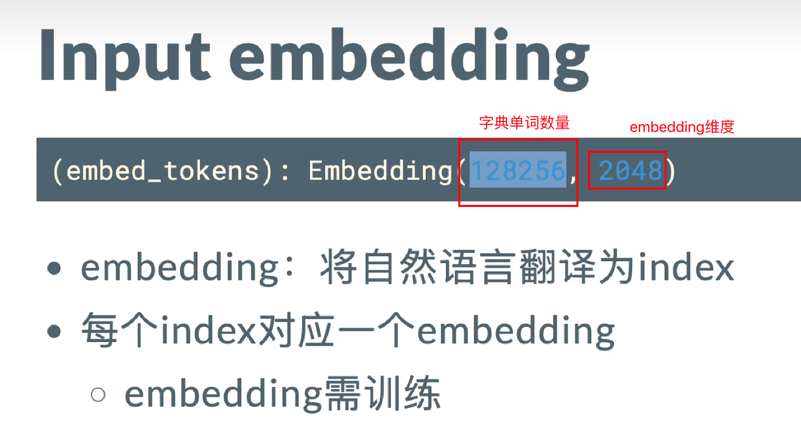  

embedding需要训练，但我们开发者可以直接使用（除非我们想更新字典库）

字典库可理解为：给LLM（不是人类）看的百科全书，字典库中每个token都拥有详细解释

翻译过程：tokenizer

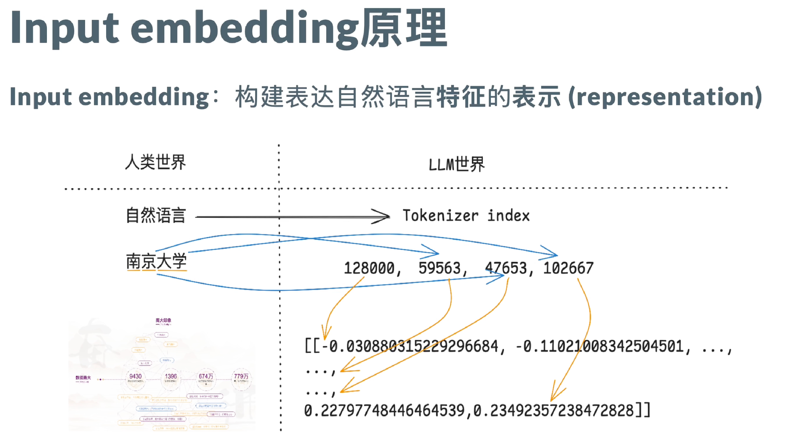  

上图中128000与“南京大学”无关，是翻译的头(LLM特殊字符)

LLM本质上是一个while循环，因此需要知道开始和结束的节点

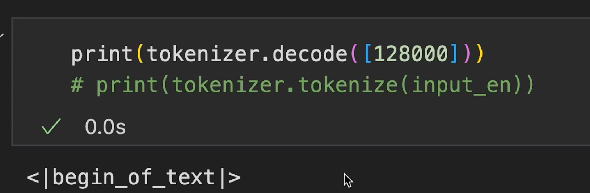  

59563对应“南”

47653对应“京”

102667对应“大学”

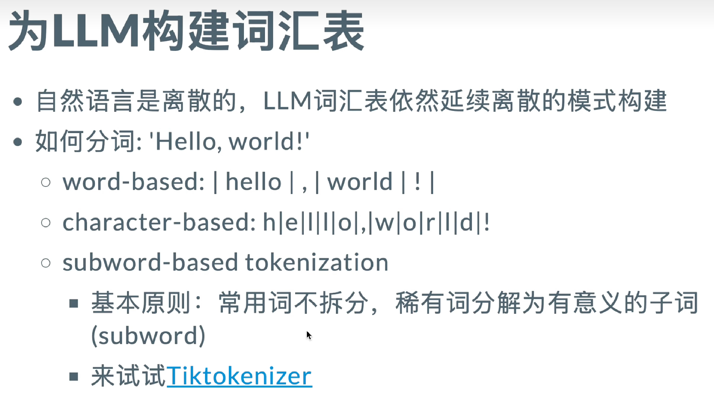  

word-based缺点：出现词汇表没有的词的时候不好表示

character-based解决word-based的问题，毕竟所有英文单词都能用26字母和有限特殊符号表示

缺点：粒度过细，拆分了单词的语义

对于英语来说可以使用subword-based策略（中文与英文不同，可能采取其他策略）

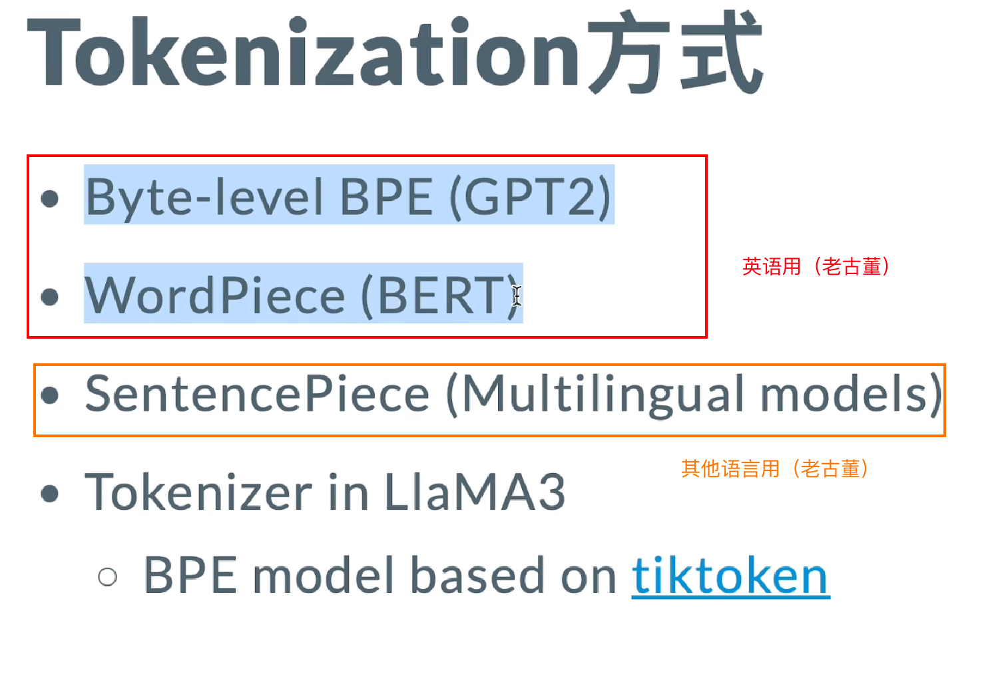  

embedding把自然语言转换成词汇表的index，LLM自己通过index查词汇表得到实际的词汇

attention模块只计算单词之间的相似度

然而实际自然语言是一个序列，同一个单词在不同位置可能表示不同的意思，因此“单词位置“对于自然语言序列也很重要

为了表示单词位置，引入了位置编码(Position Embedding)

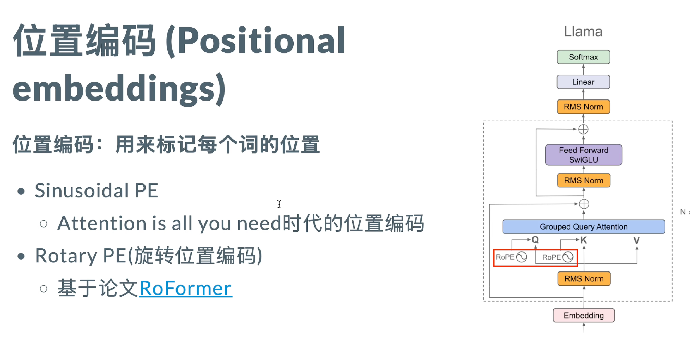  

老模型

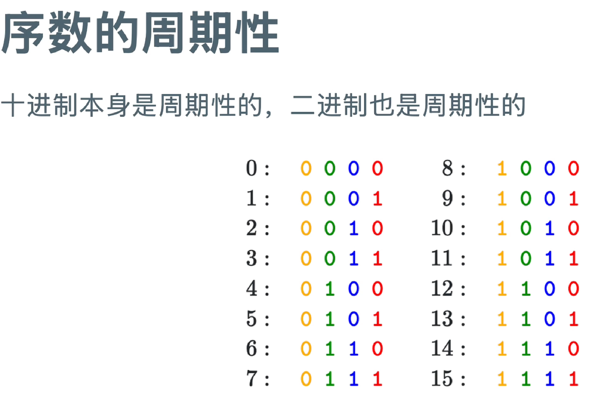  

从个位到高位，周期频率变低

- 可以用不同频率的周期函数表示不同位置

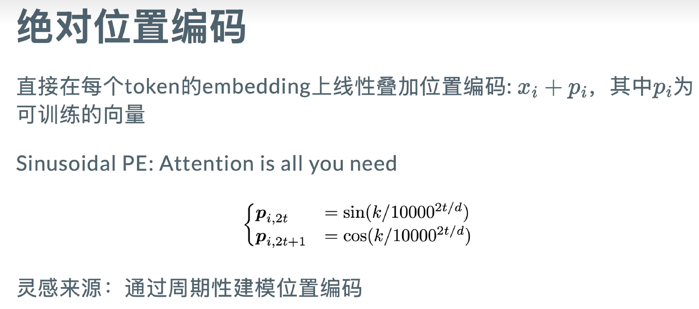  

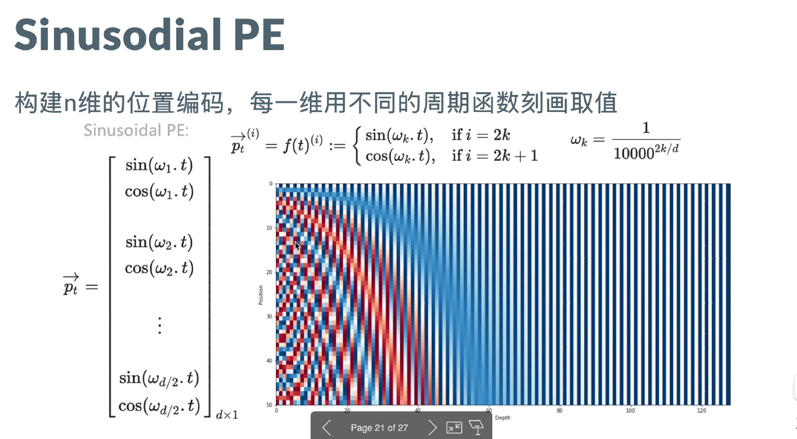  

depth 越大， 周期?

引出长文本问题

Llama模型

pe模块嵌入到attension模块中

问题：什么是算子，为什么要升维，为什么要降维，nn.module

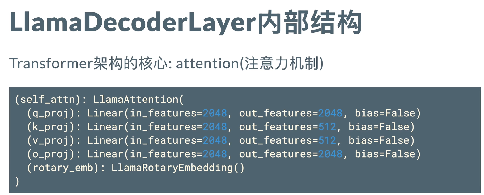  

q: query
k & v : key & value

为什么叫自注意力机制，因为q & k & v输入都来自于hidden states（输入相同）

否则只是叫注意力机制

问题：
1. 为什么LLM采用右对齐而不是左对齐
2. hidden states的shape?

始终以token为粒度

训练注意力的时候，基于生成式的性质，生成的token只能根据历史来生成

因此当整段文本输入训练时，需要给模型“蒙上眼睛”，让它看不见当前token之后的token，这就需要mask

bias：用于微调，调整某些token的权重（标准的时候没有bias）

reshape和view的区别
- reshape更改数据底层存储
- view仅改变逻辑

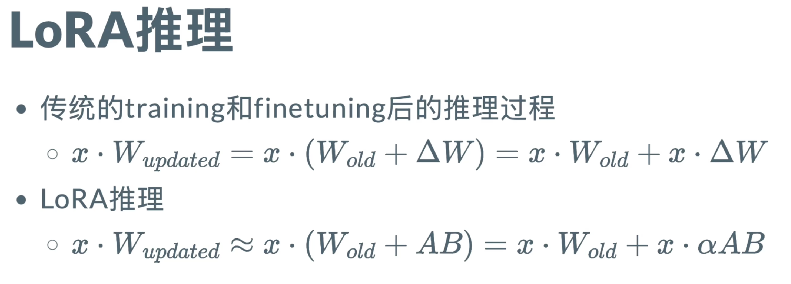  

AB如果初始化不为0，delta太大，导致变化不稳定

初始化为0，慢慢调整，保证启动稳定

因此通常把B调整为0，A为rand

A不能为0，否则没有梯度了

Q：
padding对齐方向？为什么？