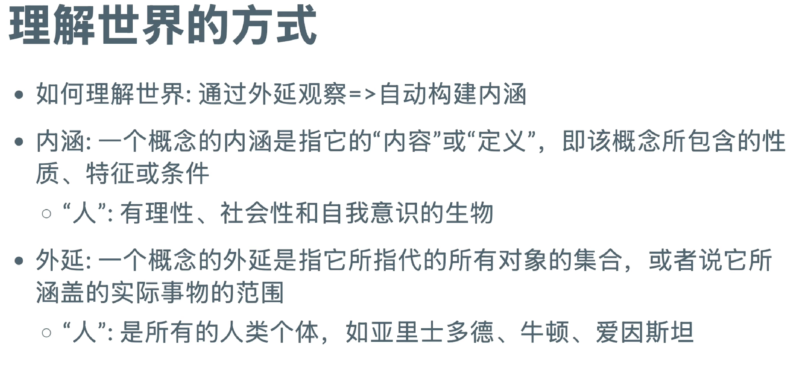
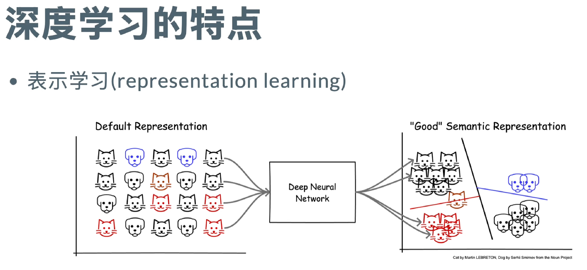
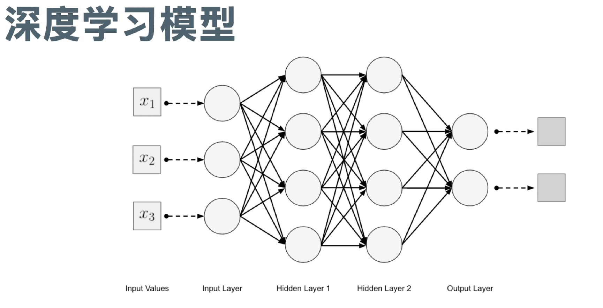
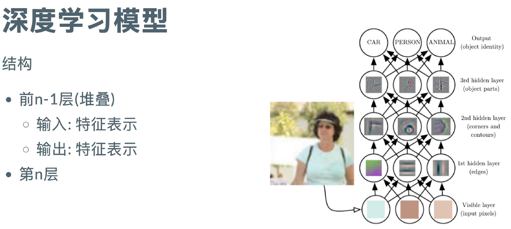
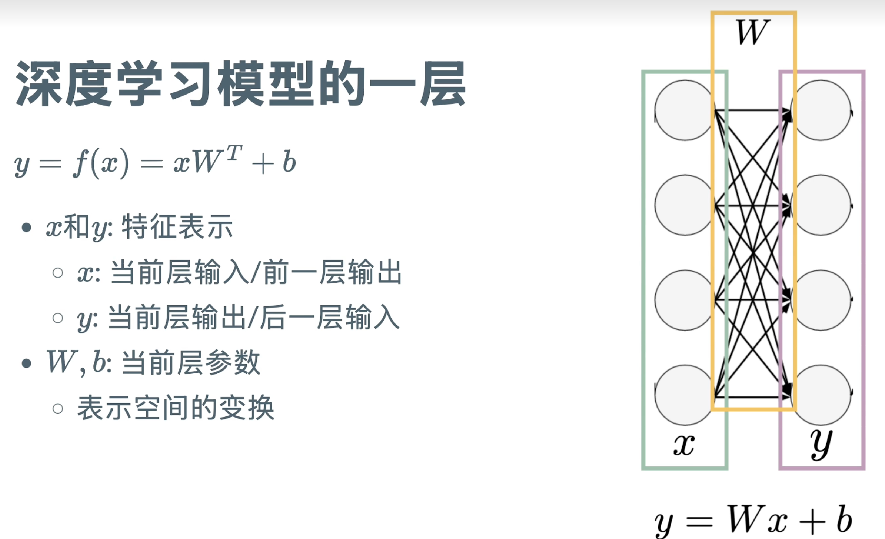
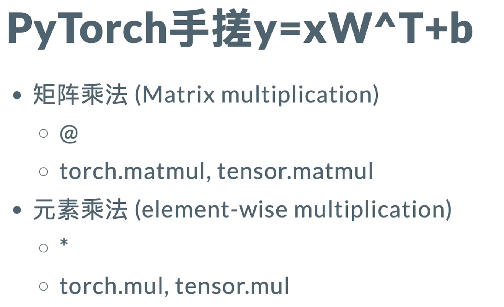
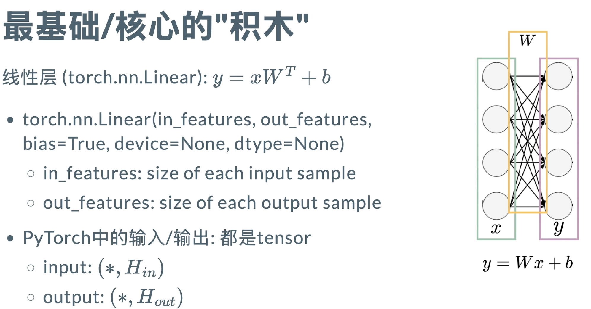
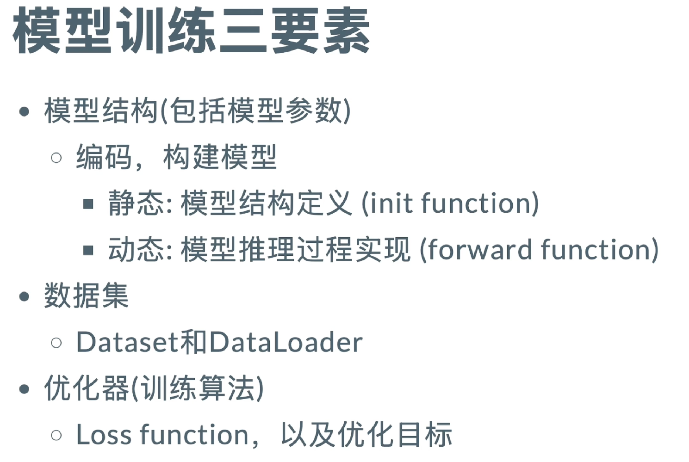
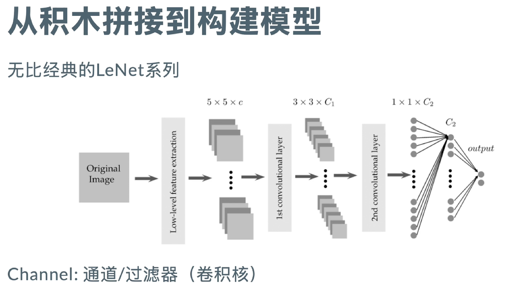
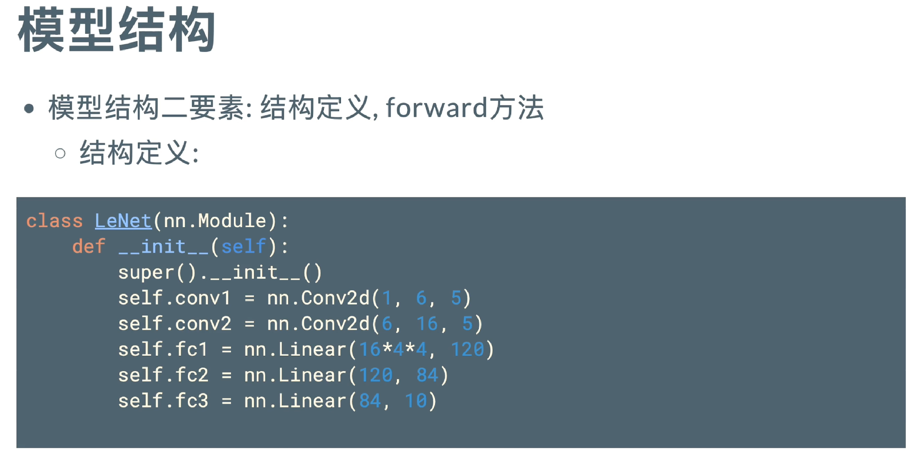

# 深度学习基础

> **为什么叫深度学习**
> 
> 深度指的是搭积木模式的堆叠，即$y_1 = f(x), y_2 = f(y_1)... y_n = f(y_{n - 1})$

 

理解世界：将知识压缩成一个模型，通过提供输入，模型提供输出，可以得到对于世界的理解结果。

y = f(x) = Wx + b

- 在torch中W指tensor张量
- x输入
- y任务目标

通过举例子，告诉模型这个是什么，那个是什么。通过足够多的例子，建立理解。

- 设定任务目标
- 参数的选取：确定W和b的值，即模型的训练过程
  - 如何训练模型（如何确定参数）：
    - 收集外延：数据集
    - 构建内涵：学习特征（包括模型框架的选取（$y = Wx + b$ 还是 $y = Wx^2 + b$，参数的确定等等）

  

传统的机器学习：人类确定表示方式，将输入进行分类，再喂给模型

深度学习：模型自己确定表示方式，输入为最原始的未经人为处理的形式，抽取特征交给模型处理

举个例子，给出一堆猫狗照片，任务目标是区分猫狗

如果是传统的机器学习，由于猫狗特征特别多，人类会根据自己对任务和特征的理解，给出猫的特征有哪些，狗的特征有哪些。比如说人为确定猫狗在毛发、骨骼等两个不同的特征，提供带有两个特征的猫狗数据集，让模型区分哪些是猫，哪些是狗。

但如果是深度学习，人类直接将猫狗图片交给模型，特征数量未知，由模型确定，让模型在大量数据集的训练中提取特征。

  

模型学习过程与结构

单点特征->局部特征->整体特征

  

torch定义需要将W转置

  

  

在深度学习中，比起数据值，更关注数据的维度

[10,5]可以表示batch size为10的样本集，每个样本（batch）维度为5

[5,3]可以表示batch size为5的样本集，每个样本（batch）维度为3

[10,5] 与 [5,3]作矩阵乘法，可以得到[10,3]维度的结果集，10表示batch size样本数，3表示每个样本的维度

从[10,5]到[10,3]可以视作发生了空间的变换

> pytorch封装了很多操作，例如转置

  

  

  

问题：什么是卷积，什么是channel 数量

# lesson2

大语言模型本质上还是深度学习模型

## 模型结构

  

训练模型其实是搭积木，最重要的就是尺寸匹配， 即初始化

问题：为什么叫fc(full connection全连接)

卷积不需要定义输入输出尺寸

大模型本质还是一个分类模型

问题：损失函数

