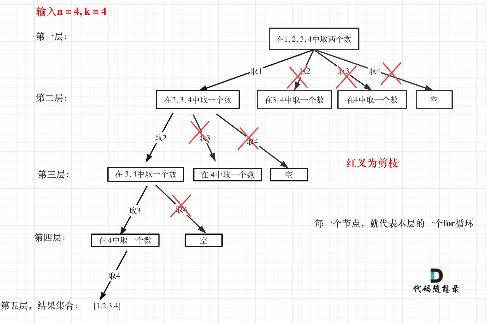

# 77 组合

如下图所示，组合问题本质上是一个树形求解问题，有以下性质

1. 取了的数不能再取
2. 获取到指定k个数后，立即返回结果，不再继续遍历

对于性质1，可以通过增加参数startIndex确定每次遍历的起始索引，[1,startIndex)为已经遍历过的，[startIndex,n]为未遍历的

> PS：
>
> 对于自然数组合问题，给定的集合，恰好满足：索引i对应的值i
>
> 对于其他组合，例如给定集合{A,B,C,D}，则不满足该规律，因此是path.push_back(集合的值)

对于性质2，采用回溯的方法

```C++
if(condition)
{
		//procedure
		return;
}
```


```C++
class Solution {
private:
    vector<vector<int>> ans;
    // path数组用于记录满足结果的集合
    vector<int> path;
    // startIndex用于记录下一次开始的元素，避免重复
    void dfs(int n, int k, int startIndex){
        if(path.size() == k){
            ans.push_back(path);
            return;
        }
        for(int i = startIndex; i <= n; i++){
            path.push_back(i);
            dfs(n, k, i + 1);
            path.pop_back();
        }
    }
public:
    vector<vector<int>> combine(int n, int k) {
        dfs(n, k, 1);
        return ans;
    }
};
```

## 优化版

对于上述问题，我们可以进一步进行剪枝优化

如下图，当n=4, k=4，我们发现第一个数取1，进行到第四层就能遍历所有可能（1,2,3,4），因此第一层循环不需要2及之后的元素，第二层不需要3及之后的元素，其余同理

假设当前取的元素集合为path，个数为`path.size()`，那么我们还需要取的元素个数为`k - path.size()`

总共有n个元素，假设起始索引startIndex取到最大值，使得startIndex之后的元素个数恰好为`k - path.size()`

那么startIndex的值为`n - (k - path.size()) + 1`，可以通过n - startIndex = k - size() + 1计算

```C++
// 剪枝部分
for(int i = startIndex; i <= n - (k - path.size()) + 1; i++){
	path.push_back(i);
	dfs(n, k, i + 1);
	path.pop_back();
}
```




```C++
class Solution {
private:
    vector<vector<int>> ans;
    // path数组用于记录满足结果的集合
    vector<int> path;
    // startIndex用于记录下一次开始的元素，避免重复
    void dfs(int n, int k, int startIndex){
        if(path.size() == k){
            ans.push_back(path);
            return;
        }
      	// 剪枝部分
        for(int i = startIndex; i <= n - (k - path.size()) + 1; i++){
            path.push_back(i);
            dfs(n, k, i + 1);
            path.pop_back();
        }
    }
public:
    vector<vector<int>> combine(int n, int k) {
        dfs(n, k, 1);
        return ans;
    }
};
```

## 另一思路

根据二进制由每位进1的思想

我们也可以从最初递增序列1,2,3,4,...,共k个数开始递增，直到到达最大序列

- 该递增为让最高位一次递增，其余位不变
- 但是递增最高位的过程，会导致前面的位发生改变，因此最高两位满足递增关系时，说明已经满足组合关系，将前面的数置为初始序列

方法为：

- 从左往右，找到第一个满足$a_j + 1 \neq a_{j+1}$，说明已经不满足递增了，因此将$a_j + 1$
- 为了使第一个序列能够执行上述算法，引入哨兵节点，在第k位加入n + 1，保证第k - 1位不满足$a_j + 1 \neq a_{j+1}$

> 例如，n = 4，k = 2
>
> 最初序列为1,2[5] （[5]为哨兵节点）
>
> 接着我们需要得到1,3[5] 
>
> - 为了得到1,3[5]，根据算法我们需要先得到2,3[5] ，得到2,3[5] 后，将前面的第j位重新置为$j + 1$
>
> 以此类推
>
> 你会发现这种算法与二进制非常类似，最高位进位后，剩余的位将重新置为0

```C++
class Solution {
public:
    vector<int> temp;
    vector<vector<int>> ans;

    vector<vector<int>> combine(int n, int k) {
        // 初始化
        // 将 temp 中 [0, k - 1] 每个位置 i 设置为 i + 1，即 [0, k - 1] 存 [1, k]
        // 末尾加一位 n + 1 作为哨兵
        for (int i = 1; i <= k; ++i) {
            temp.push_back(i);
        }
        temp.push_back(n + 1);
        
        int j = 0;
        while (j < k) {
            ans.emplace_back(temp.begin(), temp.begin() + k);
            j = 0;
            // 寻找第一个 temp[j] + 1 != temp[j + 1] 的位置 t
            // 我们需要把 [0, t - 1] 区间内的每个位置重置成 [1, t]
            while (j < k && temp[j] + 1 == temp[j + 1]) {
                temp[j] = j + 1;
                ++j;
            }
            // j 是第一个 temp[j] + 1 != temp[j + 1] 的位置
            ++temp[j];
        }
        return ans;
    }
};
```


