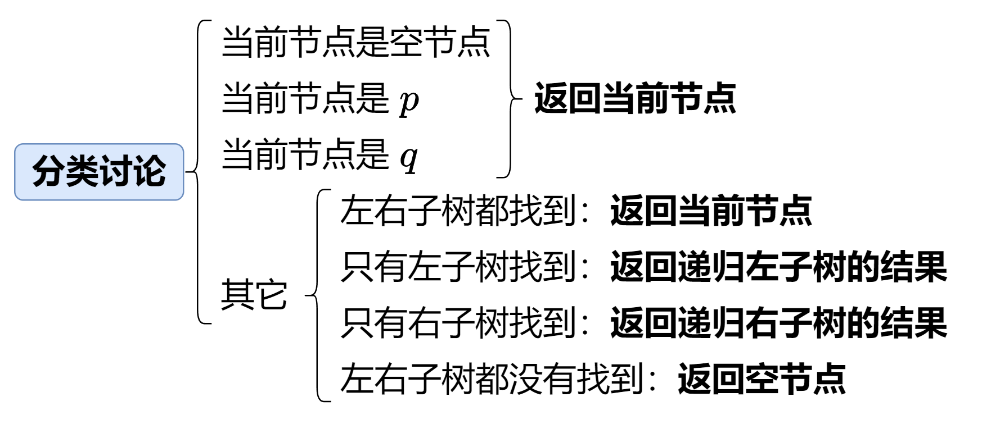

# 236 二叉树的最近公共祖先

分类讨论，给定两个节点p和q，有两种情况：

- p和q没有直接或间接父子节点关系，那么p和q一定分别在某个节点的左子树和右子树，这个节点就是最近公共祖先
- p和q有直接或间接的父子节点关系，假设p为q的直接或间接父节点，那么q一定在p的左子树或右子树

## 前序遍历

前序遍历访问顺序：中左右，这意味着我们需要先判断当前节点，才能访问左右子树

最近公共祖先的唯二情况：

- 左子树含有p，当前节点为q / 右子树含有p，当前节点为q
  - 在前序遍历中，由于前序遍历会先访问到q，再访问到p（也就是先访问到最近公共祖先），因此只需要：一旦访问到值为p或q的节点，立马返回当前节点，该节点就是最近公共祖先
- 左右子树分别含有p或q，表明当前节点就是最近公共祖先
  - 因为是前序遍历，因此从这次判断之后，不会再出现左右子树分别含有p或q的情况，只会出现左子树有p 或右子树有q
  - 因此只要触发这个条件，我们就能判断当前节点就是最近公共祖先

具体算法如下图：



解释一下边界条件：

- 当前节点是空节点 -> 返回当前节点 （这个应该不用解释）
- 前序遍历的性质保证了函数返回的结果就是第一个满足最近公共祖先的结果
  - 只有左子树找到 -> 说明p或q就在左子树中，返回递归左子树的结果
  - 只有右子树找到 -> 说明p或q就在右子树中，返回递归右子树的结果
  - 左右子树都没有找到 -> 返回空节点（表示当前子树不含有p 或 q）

```C++
/**
 * Definition for a binary tree node.
 * struct TreeNode {
 *     int val;
 *     TreeNode *left;
 *     TreeNode *right;
 *     TreeNode(int x) : val(x), left(NULL), right(NULL) {}
 * };
 */
class Solution {
public:
    TreeNode* lowestCommonAncestor(TreeNode* root, TreeNode* p, TreeNode* q) {
        if(!root || root == p || root == q)
            return root;
        TreeNode* left = lowestCommonAncestor(root->left, p, q);
        TreeNode* right = lowestCommonAncestor(root->right, p, q);
        if(left && right)
            return root;
        if(!left && right)
            return right;
        if(!right && left)
            return left;
        return nullptr;
    }
};
```

时间复杂度：O(N)，其中 N 是二叉树的节点数。二叉树的所有节点有且只会被访问一次，因此时间复杂度为 O(N)。

空间复杂度：O(N) ，其中 N 是二叉树的节点数。递归调用的栈深度取决于二叉树的高度，二叉树最坏情况下为一条链，此时高度为 N，因此空间复杂度为 O(N)。


## 后序遍历

后序遍历访问顺序：左右中，这意味着后序遍历能够先获取左右子树是否含有p或q的信息，再处理根节点

最近公共祖先的唯二情况：

- 左右子树分别含有p或q，表明当前节点就是最近公共祖先
  - 从这次判断之后，进行回溯，p和q会在同一个子树中，而不是不同子树
  - 因此只要触发这个条件，我们就能判断当前节点就是最近公共祖先
- 左子树含有p，当前节点为q / 右子树含有p，当前节点为q
  - 只要触发这个条件，我们就能判断当前节点就是最近公共祖先

由于后序遍历的性质，函数返回的结果并不是最近公共祖先，而是最近公共祖先的父节点

因此我们没有必要让函数返回节点，只需要返回bool值表示是否存在p或q即可

因此我们需要使用ans变量额外存储这个变量

```C++
/**
 * Definition for a binary tree node.
 * struct TreeNode {
 *     int val;
 *     TreeNode *left;
 *     TreeNode *right;
 *     TreeNode(int x) : val(x), left(NULL), right(NULL) {}
 * };
 */
class Solution {
public:
    TreeNode* ans;
    bool dfs(TreeNode* root, TreeNode* p, TreeNode* q){
        if(!root)
            return false;
        bool leftStat = dfs(root->left, p ,q);
        bool rightStat = dfs(root->right, p ,q);
        if((leftStat && rightStat) || ((root == p || root == q) && (leftStat || rightStat)))
            ans = root;
     		// 最后返回值，我们不关心最近公共祖先是哪个，我们只关心当前子树是否含有p或q
      	// 因此只要左子树出现了p或q / 左子树出现了p或q / 当前节点为p或q 就能表示当前子树含有p或q
        return leftStat || rightStat || root == p || root == q;
    }
    TreeNode* lowestCommonAncestor(TreeNode* root, TreeNode* p, TreeNode* q) {
        if(!root)
            return nullptr;
        dfs(root,p,q);
        return ans;
    }
};
```

复杂度分析

时间复杂度：O(N)，其中 N 是二叉树的节点数。二叉树的所有节点有且只会被访问一次，因此时间复杂度为 O(N)。

空间复杂度：O(N) ，其中 N 是二叉树的节点数。递归调用的栈深度取决于二叉树的高度，二叉树最坏情况下为一条链，此时高度为 N，因此空间复杂度为 O(N)。


