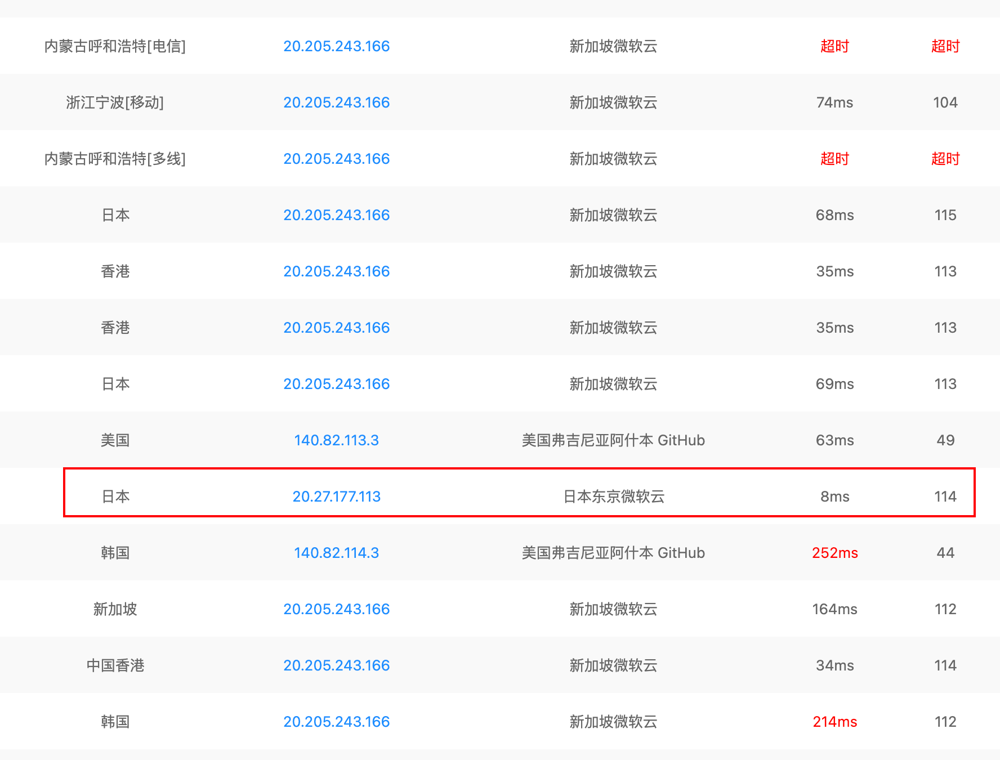
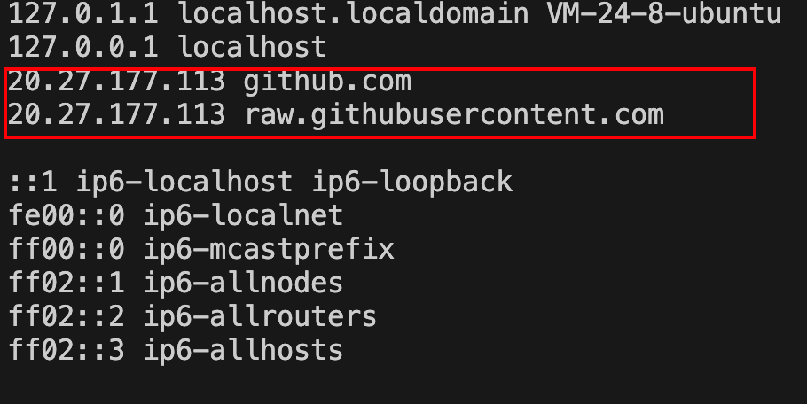

# 服务器

## 检查网络设置

使用`ping www.github.com`检查是否能连上Github

如果不能，采用以下方法解决：[服务器连不上Github](#无法连接github)

## 配置vim


## 配置oh-my-zsh

[配置terminal](./terminal.md)

## 配置Go环境

[ubuntu安装Go](https://blog.csdn.net/guo_zhen_qian/article/details/134319002)

## Problems & Solutions

收集一些遇到的问题

### 无法连接Github

第一步： 通过这个链接[Github IP地址大全](https://ping.chinaz.com/github.com)寻找可用的IP地址

第二步： 找到可用（不超时）的IP地址，如下图，我们`ping`的时候发现IP地址20.205.243.166不行，我们就换一个日本的IP(20.27.177.113)

  

第三步：

打开hosts文件

```bash
vim /etc/hosts
```

填入以下两行

```code
192.30.255.112 github.com
192.30.255.112 raw.githubusercontent.com
```

192.30.255.112对应<我们找到的IP地址>

效果如下图：

  

现在，Github可以使用了