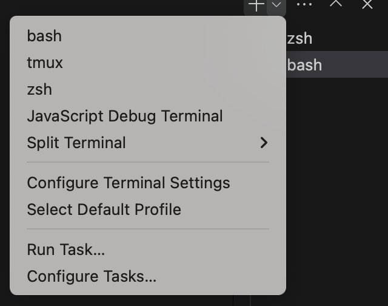

# Terminal

本章节介绍如何配置好用的terminal

## 检查shell默认是否为zsh

```bash
echo $SHELL
```
如果得到结果为`/bin/bash`说明默认为bash，如果为`/bin/zsh`说明默认为zsh（我的mac默认为zsh）

对于Linux服务器，通常默认为bash，我们需要将其调整为zsh，操作如下：

!!! warning

    **最好不要在vscode的terminal中完成以下步骤。**
    
    vscode容易踩坑，如下图：

      

    很可能你的terminal选择的是bash，这样无论你怎么操作我给的步骤，`echo $SHELL`时都会输出`/bin/bash`，这是因为vscode把当前的SHELL锁死了

    如果你实在想在vscode的terminal中进行，那么需要将右上角的bash选择为zsh

如果没有zsh，下载zsh

=== "ubuntu"

```bash
sudo apt-get install zsh
```
=== "mac"

```bash
brew install zsh
```

切换到zsh:

```bash
chsh -s $(which zsh)
```

PS: 切换回bash

```bash
chsh -s $(which bash)
```

## 下载oh-my-zsh

```bash
sh -c "$(curl -fsSL https://raw.github.com/ohmyzsh/ohmyzsh/master/tools/install.sh)"
```

## 配置oh-my-zsh


修改`.zshrc`配置文件
```bash
vim ~/.zshrc
```
添加及修改如下内容：

```
ZSH_THEME="ys"
COMPLETION_WAITING_DOTS="true"
plugins=(git
         vi-mode
         zsh-autosuggestions
         zsh-syntax-highlighting
         extract
)
setopt no_nomatch
```
`vi-mode`：让zsh也启用vim模式

[安装插件](#plugins)

### 更改主题

主题详见[theme](https://github.com/ohmyzsh/ohmyzsh/wiki/Themes)

```bash
vim ~/.zshrc
# 找到
ZSH_THEME="robbyrussell"
# 例如修改为
ZSH_THEME="ys"
```
### Plugins

#### zsh-completions

根据历史使用指令的指令自动提示补全插件。下载安装方法：

1. 克隆github上该项目（默认在 ~/.oh-my-zsh/custom/plugins）
   
   ```bash
    git clone https://github.com/zsh-users/zsh-autosuggestions ${ZSH_CUSTOM:-~/.oh-my-zsh/custom}/plugins/zsh-autosuggestions
    ```
  
2. 将 zsh-autosuggestions 添加到 ~/.zshrc 中

    ```bash
    plugins=(zsh-autosuggestions)
    ```

3. 重启zsh

#### zsh-syntax-highlighting

zsh指令语法高亮。

下载安装：

1. Clone this repository in oh-my-zsh's plugins directory:

```bash
git clone https://github.com/zsh-users/zsh-syntax-highlighting.git ${ZSH_CUSTOM:-~/.oh-my-zsh/custom}/plugins/zsh-syntax-highlighting
```

2. 配置 ~/.zshrc 的 plugins

```bash
    plugins=( [plugins...] zsh-syntax-highlighting)
```

3. 重启zsh

