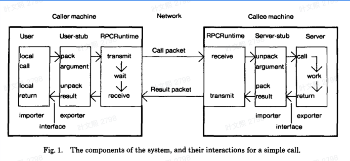
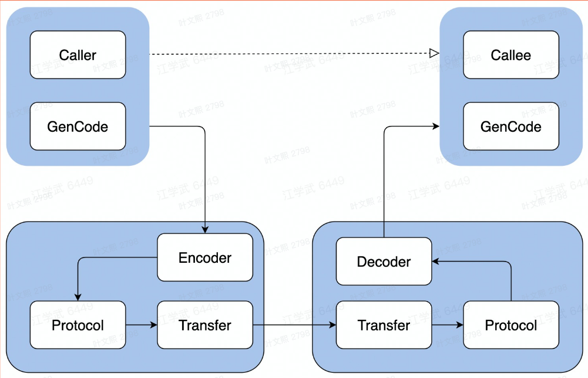
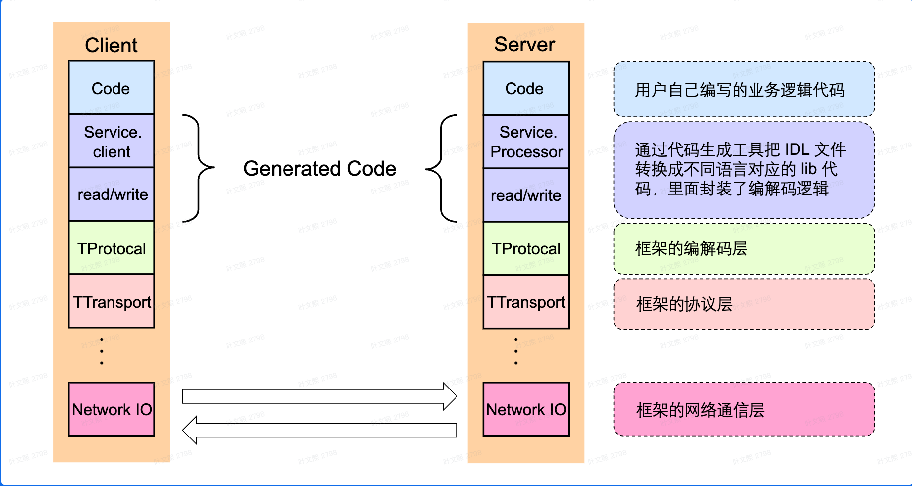

# RPC

RPC (Remote Procedure Call) ，即远程过程调用。通俗来讲，就是调用远端服务的某个方法，并获取到对应的响应。

RPC不是一种协议，而是一种调用方式，它是基于微服务架构而诞生的一种通信方式，以满足众多服务之间网络通信的需求，目的是**希望程序员能像调用本地方法那样去调用远端的服务方法。** Thrift和gRPC这样的具体实现，才是协议，是实现了RPC调用的协议。

!!! note "希望程序员能像调用本地方法那样去调用远端的服务方法"

    这句话的理解需要结合[软件架构](../Software_Engineering/system_design.md)的知识理解。
    
    一开始软件架构是**单机&单体架构**，这时候软件系统各模块之间直接通过本地函数调用即可实现通信。
    
    而到了**微服务架构**，软件系统被拆分成众多独立的服务，每个服务可能分布在不同的机器上，因此服务之间采用的是网络通讯。如果我们仍然希望服务之间能够像单体架构一样通过函数调用完成通信，那么需要一个通信方式，使**程序员能像调用本地方法那样去调用远端的服务方法**，这就是RPC


## 为什么要有RPC

推荐阅读：

- [既然有HTTP协议，为什么还要有RPC](https://xiaolincoding.com/network/2_http/http_rpc.html#http-%E5%92%8C-rpc)
- [RPC和HTTP的区别](https://juejin.cn/post/7241726312779661373)
- [RPC和HTTP的区别](https://juejin.cn/post/7100602664534147079)

简单来说，HTTP适用于B/S架构，RPC适用于C/S架构：
- B/S架构：Browser需要连多个Server，因此需要统一通信标准。HTTP协议就是用于统一B/S架构的通信协议，HTTP为了统一做了大量冗余的设计，比如说content-type等等。**软件与外部通信一般使用HTTP**
- C/S架构：软件只需要客户端和自家的服务端连接即可，因此可以定制通信标准。不需要统一通信的前提下，RPC具有更高效的通信效率，比如说RPC使用protobuf等**二进制序列化/反序列化协议**。**软件内部各服务通信一般使用RPC**

## RPC介绍

RPC解决三个问题：

1. 函数映射
2. 数据转换为字节流
3. 网络传输

### RPC 调用的流程

一次 rpc 调用包括以下基本流程，分为客户端和服务端两个部分：

1. （客户端）构造请求参数，发起调用
2. （客户端）通过服务发现、负载均衡等得到服务端实例地址，并建立连接
3. （客户端）请求参数序列化成二进制数据
4. （客户端）通过网络将数据发送给服务端

---

5. （服务端）服务端接收数据
6. （服务端）反序列化出请求参数
7. （服务端）handler 处理请求并返回响应结果
8. （服务端）将响应结果序列化成二进制数据
9. （服务端）通过网络将数据返回给客户端

---

10. （客户端）接收数据
11. （客户端）反序列化出结果
12. （客户端）得到调用的结果

 


!!! Tip

    其中步骤 2 中包含的流程称为「服务治理」，通常包括并不限于服务发现、负载均衡、ACL、熔断、限流等等功能。这些功能是由其他组件提供的，并不是 Thrift 框架所具有的功能。

 

这一过程中涉及RPC的多个核心概念：

1. **[IDL(interface description language)](#idl)：** IDL通过一种中立的方式来描述接口，使得在不同平台上运行的对象和用不同语言编写的程序可以相互通信

2. **clinet/server stub**
   
   一段代码，负责将clinet/server的数据转换为rpc框架内使用的数据格式，包括两个部分：

   1. **[生成代码](#生成代码)：** 这部份不需要我们写，通常通过RPC框架通过编译器工具把IDL文件转换成语言对应的静态库，

   2. **[编解码](#序列化和反序列化协议)：** 从内存中表示到字节序列的转换称为「编码」，反之为「解码」，也常称为「序列化和反序列化」

3. **通信协议：** 规范了数据在网络中的传输内容和格式。除必须的请求/响应数据外，通常还会包含额外的元数据。

4. **网络传输：** 通常基于成熟的网络库走TCP/UDP传输

  

  

### IDL

IDL 全称是 Interface Definition Language，接口定义语言。

如果我们要使用 RPC 进行调用，就需要知道对方的接口是什么，需要传什么参数，同时也需要知道返回值是什么样的，就好比两个人之间交流，需要保证在说的是同一个语言、同一件事。IDL 就是为了解决这样的问题，通过 IDL 来约定双方的协议，就像在写代码的时候需要调用某个函数，我们需要知道 签名一样。

对于 RPC 框架，IDL 不仅作为接口描述语言，还会根据 IDL 文件生成指定语言的接口定义模块，这样极大简化了开发工作。

- 服务提供方（服务端）需要做的：为 编写 IDL -> 使用代码生成工具生成代码 -> 实现接口；
- 服务调用方（客户端）只需根据服务提供方（服务端）提供的 IDL 生成代码后进行调用。

这当中还有服务发现、负载均衡等问题，但不属于 IDL 范畴，故不展开介绍。

**常见的IDL有：**

- `thrift`
- `proto3`
- `proto2`

#### Proto3

[Proto3语言指南（官网中文版）](https://protobuf.com.cn/programming-guides/proto3/#options)

[Proto3语言指南（官网英文版）](https://protobuf.dev/programming-guides/proto3/)

[Go语言Protobuf入门](https://protobuf.com.cn/getting-started/gotutorial/)

**快速入门**

以下是一个proto3文件

```proto hl_lines="5-7"
syntax = "proto3";

package example;

service Greeter {
  rpc SayHello (HelloRequest) returns (HelloResponse);
}

message HelloRequest {
  string name = 1;
}

message HelloResponse {
  string message = 1;
}
```

1. 第一行指明proto文件的版本：proto3

2. message对应Go中的结构体。

3. service对应Go中的接口。

4. 数字对应的是字段的Tag，唯一标识字段，因此Tag不可重用。

??? tip "service数据结构"

    ```proto
    service Greeter {
      rpc SayHello (HelloRequest) returns (HelloResponse);
    }
    ```

    service不是protobuf本身拥有的结构，而是对应rpc定义的服务接口，如果想要使用rpc，才使用service
    
    protobuf本质上只是一个和json类似的序列化协议

??? warning "删除字段"

    如果要删除字段，新字段需要使用新的Tag。
    
    可以从消息中删除该字段的定义。但是，**必须**保留已删除的字段编号。

    ```proto3
    message Foo {
        reserved 2, 15, 9 to 11;
    }
    ```

protobuf编译器protoc编译后：

- 根据**message数据类型**附带一些辅助方法用于序列化、反序列化等操作。
- 根据**service接口**生成客户端和服务端的实现框架，方便开发者直接使用或扩展。

`repeated`类型对应动态数组

`reserved`记录被删除的字段名/Tag

### 生成代码

核心是protoc编译器对proto文件进行编译

go语言需要额外的插件生成go代码

[Go语言代码生成指南](https://protobuf.com.cn/reference/go/go-generated/)

### 序列化和反序列化协议

序列化：序列化就是将数据结构或对象转换成二进制串的过程。

反序列化：将在序列化过程中所生成的二进制串转换成数据结构或者对象的过程。

#### Protocoal Buffers(Protobuf)

Protobuf（Protocol Buffers）是由 Google 开发的一种序列化协议。它使用简单的 IDL 来定义数据结构，生成相应语言的代码进行序列化和反序列化。Protobuf 以一种较为紧凑的格式存储和传输数据，支持向前和向后兼容性，且在不同语言之间的交互性强。

在编码方面Protocol Buffers对比JSON、XML的优点：

1. 简单，体积小，数据描述文件大小只有1/10至1/3;
2. 传输和解析的速率快，相比XML等，解析速度提升20倍甚至更高;
3. 可编译性强。

### RPC 服务开发流程

例如基于 Thrift 的 RPC 服务开发，通常包括如下过程：

1. 编写 IDL，定义服务 (Service) 接口。
2. 使用 thrift（或者等价的生成代码工具，如 kitex 等）生成客户端、服务端的支持代码。
3. 服务端开发者编写 handler ，即请求的处理逻辑。
4. 服务端开发者运行服务监听端口，处理请求。
5. 客户端开发者编写客户端程序，经过服务发现连接上服务端程序，发起请求并接收响应。

## RPC框架

一般来说，RPC 框架包括了代码生成、序列化、网络通讯等，主流的微服务框架也会提供服务治理相关的能力，比如服务发现、负载均衡、熔断等等。

开源 RPC 框架有哪些呢？

一类是跟某种特定语言平台绑定的，另一类是与语言无关即跨语言平台的。

跟语言平台绑定的开源 RPC 框架主要有下面几种。

- Dubbo：国内最早开源的 RPC 框架，由阿里巴巴公司开发并于 2011 年末对外开源，仅支持 Java 语言。
- Motan：微博内部使用的 RPC 框架，于 2016 年对外开源，仅支持 Java 语言。
- Tars：腾讯内部使用的 RPC 框架，于 2017 年对外开源，仅支持 C++ 语言。
- Spring Cloud：国外 Pivotal 公司 2014 年对外开源的 RPC 框架，仅支持 Java 语言

而跨语言平台的开源 RPC 框架主要有以下几种:

- [gRPC](#grpc)：Google 于 2015 年对外开源的跨语言 RPC 框架，支持多种语言。
- Thrift：最初是由 Facebook 开发的内部系统跨语言的 RPC 框架，2007 年贡献给了 Apache 基金，成为 Apache 开源项目之一，支持多种语言。

如果你的业务场景仅仅局限于一种语言的话，可以选择跟语言绑定的 RPC 框架中的一种；

如果涉及多个语言平台之间的相互调用，就应该选择跨语言平台的 RPC 框架。

### gRPC

`grpc`以`tcp`作为网络传输协议，以`protobuf`作为二进制序列协议，基于`HTTP/2.0`实现。

在`protobuf`定义基础上，添加了rpc服务对应的数据结构:

- `service`：rpc服务，可以拥有多个服务
- `rpc`：rpc服务里面的方法，一个服务可以拥有多个方法

```proto hl_lines="5-7"
syntax = "proto3";

package example;

service Greeter {
  rpc SayHello (HelloRequest) returns (HelloResponse);
}

message HelloRequest {
  string name = 1;
}

message HelloResponse {
  string message = 1;
}
```

grpc拥有四种rpc方法，详见[grpc进阶](https://grpc.io/docs/what-is-grpc/core-concepts/)

## RPC实战

### Go

按这个教程[Go](https://grpc.io/docs/languages/go/quickstart/)走，基本可以实践

基本思路就是：

- 写proto3文件
- 利用protoc和go的两个插件将.proto文件编译生成代码，生成的代码不用做任何修改，后缀为`<name>_rpc.pb.go`和`<name>_pb.go`
- 生成的代码包含了service的接口，server端在server/server.go实现，client只需要调用生成的代码中的NewClinet函数

???+ "go_package和package"

    **go_package**

    ```proto
    option go_package = "github.com/wymli/bc_sns/dep/pb/go/enumx;enumx";
    ```

    这里逗号（；）后面是就是生成go代码时的package名, 前面是生成代码时，如果其他proto引用了这个proto，那么他们就会使用逗号（；）前面的作为go包路径

    **package**

    package是proto的包名,一个文件就是一个package,主要用于命名空间，还用于import时解析

    ```proto
    package foo;
    ```

    import的时候

    ```proto
    import "pfoo/foo.proto"
    ```

举个例子：

hello/hello.proto

```proto
syntax = "proto3";

package hello;

option go_package = "/hello";

message Request{
    string send_message = 1;
}

message Response{
    string receive_message = 1;
}

service Hello{
    rpc SayHello(Request) returns(Response){}
}
```

server/server.go

```Go
package main

import (
	"context"
	"fmt"
	"log"
	"net"

	pb "github.com/xxxx2077/hello_demo/hello"
	"google.golang.org/grpc"
)

type HelloService struct {
	pb.UnimplementedHelloServer
}

func (s *HelloService) SayHello(c context.Context, in *pb.Request) (*pb.Response, error) {
	str := fmt.Sprintf("receive message : %v\n", in.SendMessage)
	str += "hello, my friend!\n"
	return &pb.Response{ReceiveMessage: str}, nil
}

func main() {
	listener, err := net.Listen("tcp", "localhost:8081")
	if err != nil {
		log.Fatal("wrong")
	}
	grpcServer := grpc.NewServer()
	helloService := &HelloService{}
	pb.RegisterHelloServer(grpcServer, helloService)
	grpcServer.Serve(listener)
}
```

client/clinet.go

```Go
package main

import (
	"context"
	"flag"
	"fmt"
	"log"

	pb "github.com/xxxx2077/hello_demo/hello"
	"google.golang.org/grpc"
	"google.golang.org/grpc/credentials/insecure"
)

func main() {
	flag.Parse()
	conn, err := grpc.NewClient("localhost:8081", grpc.WithTransportCredentials(insecure.NewCredentials()))
	if err != nil {
		log.Fatal("wrong conn")
	}
	defer conn.Close()
	client := pb.NewHelloClient(conn)
	message := &pb.Request{
		SendMessage: "hello, my name is client",
	}
	resp, err := client.SayHello(context.Background(), message)
	if err != nil {
		log.Fatal("wrong")
	}
	fmt.Println(resp.ReceiveMessage)
}

```

## Reference

- [什么是RPC](https://www.51cto.com/article/701423.html)