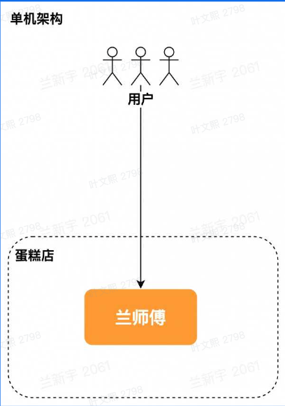
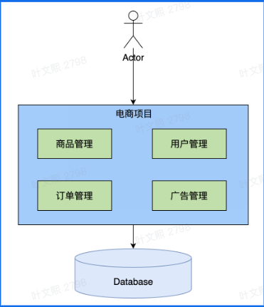
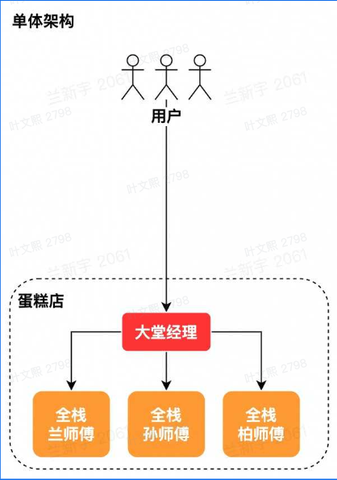
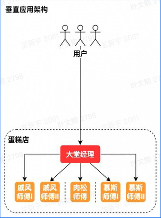
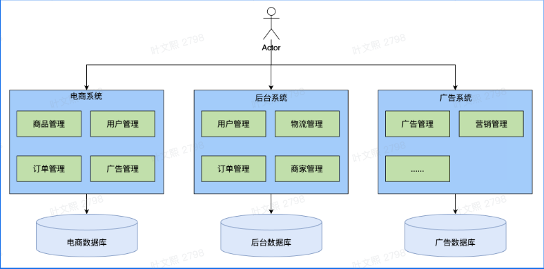
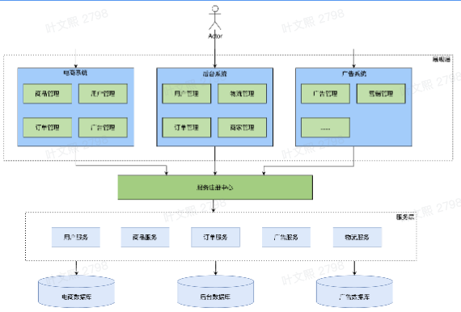
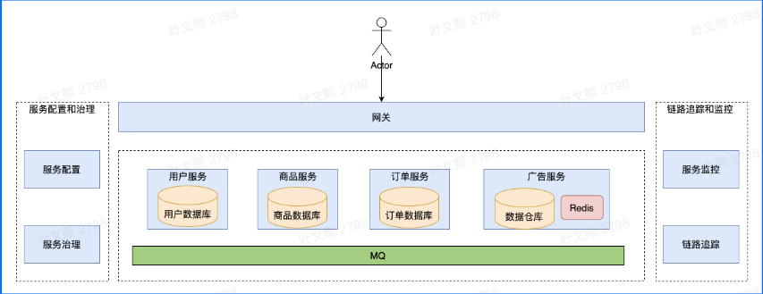

# 软件架构与系统设计 (Software Architecture and System Design) 

## 概述

软件架构，就是软件系统的组织形式

简单归纳一下软件架构的演变历史：

单机架构 & 单体架构->垂直应用架构->分布式架构->SOA架构->微服务架构

### 单机架构 & 单体架构

**单机架构：** 软件系统所有功能都实现在**一个进程**里，并部署在**一台机器**上

**单体架构：** 在单机架构的基础上，增加多台机器，每台机器都部署同一套软件，即**分布式部署**

优点：

- 性能最高
- 简单
- 冗余小

缺点：

- 运维需要停服
- debug困难
- 模块之间相互影响，耦合紧密
- 难以分工合作

问题：
- [C10k problem](http://www.kegel.com/c10k.html)

**单机架构：**

  

  

**单体架构：**

  

### 垂直应用架构 

在单机架构&单体架构的基础上，按照应用进行垂直切分

比如说做一个蛋糕可以分为戚风、肉松、慕斯，那么垂直应用架构就可以分成：

- 做戚风的师傅
- 做肉松的师傅
- 做慕斯的师傅

优点：

- 水平扩容
- 运维不需要停服
- 业务独立开发维护

缺点：

- 不同业务存在冗余
- 每个服务仍然是单体

  

  

### 分布式架构

从多个应用中抽出业务无关的公共功能模块，将其部署在不同的独立的计算节点上，这些模块通过网络进行通信。

优点：

- 业务无关的独立服务
- 服务模块bug可导致全站瘫痪
- 调用关系复杂
- 不同服务冗余

分布式架构包含了[SOA架构](#soa架构)和[微服务架构](#微服务架构)

### SOA架构

将应用的不同功能单元抽象为服务，定义服务之间的通信标准。

SOA架构的「服务」与分布式架构的「功能模块」不同之处在于：

- 「服务」高度独立，而「功能模块」可能存在依赖关系
- 「服务」强调标准化接口，而「功能模块」不一定遵循接口规范

举个例子：

- SOA服务：假设您正在开发一个电子商务平台，其中包含订单管理、库存管理和用户管理等多个服务。每个服务都独立部署，并通过RESTful API进行通信。这样，您可以单独更新订单管理系统而不影响其他服务。
- 分布式系统的功能模块：在一个大数据处理系统中，您可能有数据采集模块、数据处理模块和数据分析模块。这些模块通过消息队列（如Kafka）进行通信，并且可能共享某些数据存储资源。在这种情况下，模块之间的依赖关系较强，设计时更关注性能和数据一致性。

  

优点：

- 服务注册

缺点：

- 中心化
- 需要从上至下设计
- 重构困难

### 微服务架构

微服务架构是「去中心化」的SOA架构

  

优点：

- 业务独立设计
- 自下而上
- 故障隔离

缺点：

- 服务众多，治理、运维难度大
- 观测挑战
- 安全性

## 微服务架构

### 核心概念

**服务：** 一组具有相同逻辑的运行实体

**实例：** 一个服务中，每个运行实体即为一个实例

实例与进程的关系：实例与进程没有必然对应关系，可以一个实例对应一个或多个进程（反之不常见）

**集群：** 通常指服务内部的逻辑划分（例如10台机器中有4台来自北京，6台来自上海，那么可以分为北京集群和上海集群），包含多个实例

常见的实例承载形式：进程、VM（Virtual Machine），k8s pod

有状态/无状态服务：服务的实例是否存储了可持久化的数据（例如磁盘文件）

**服务间通信：**

- 对于单体服务，不同模块通信只是简单的函数调用
- 对于微服务，不同服务通信通过网络完成通信，常见的通信方式为：
  - **RESTful API：** 基于 HTTP 协议的 RESTful API 是最常用的微服务通讯方式之一。服务之间通过 HTTP 请求和响应进行通讯，实现数据交换。这种方式简单、通用，适用于各种场景，但可能不适合对实时性要求非常高的场景。
  - **[远程过程调用RPC](../Framework/RPC.md)：** RPC 允许一个服务像调用本地方法一样调用另一个服务的方法。它通过将方法调用封装成网络数据包并在不同的进程之间传输，实现不同服务之间的互相调用。
  - **消息队列通讯：** 如 RabbitMQ、Kafka、RocketMQ 等，服务之间不直接调用，而是通过消息队列进行异步消息传递，实现服务之间的解耦和异步处理。
  - **事件驱动通讯：** 服务之间通过事件触发通讯，一旦某个服务发生了某个事件，就会触发其他服务的响应。这种方式可以实现服务的松耦合和事件的实时处理，典型的实现如 Event Bus。
  - **WebSocket：** 使用 WebSocket 实现双向通信，常用于实时推送场景，服务间可以维持长期的 TCP 连接进行数据交换。

其中，RESTful API 和 RPC 是微服务间最常用的通讯方式，但它们的使用场景又略有不同：

- RESTful API 通常用于外部接口或第三方接口通讯。
- RPC 通常用于内部微服务之间的方法调用。

### 微服务核心要素

#### 服务治理

##### 服务注册与发现

#### 可观测性

#### 安全

### Reference
- [一文读懂软件系统开发架构C/S、B/S、微服务与分布式](https://zhuanlan.zhihu.com/p/659046250)
- [数据请求模型架构（文章2-4节）](https://zhuanlan.zhihu.com/p/161277955)
- 字节青训内部课

