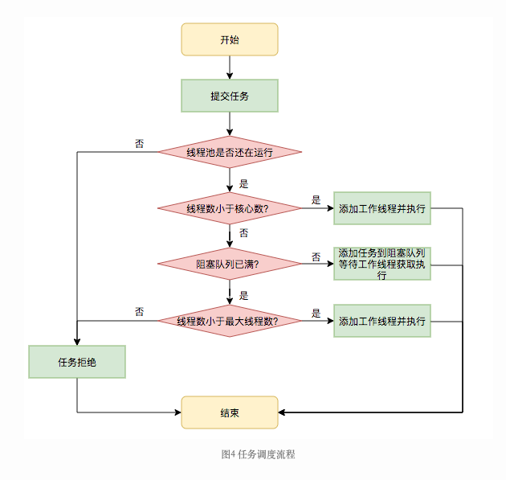

# 系统设计题

## 扫码登录机制

此处只介绍授权码模式

OAuth2在用户和资源服务器之间引入了授权层（认证服务器）

1. 用户访问客户端，点击“微信登录“
2. 客户端将用户导向认证服务器的授权页面，附上以下信息
   1. client id 客户端id（唯一标识）
   2. redirection URI（重定向URI，用于返回客户端页面）
   3. response type（响应类型）
   4. scope（授权作用范围）
3. 认证服务器验证用户的身份信息和访问权限，并要求用户提供认证信息进行身份验证（认证）；确认用户是否授权请求
4. 用户同意授权，认证服务器返回授权码给客户端
5. 客户端向认证服务器申请access token，附带「授权码」和「redirection URI」以及其他「请求授权时的信息」
   1. client id 客户端id（唯一标识）
   2. response type（响应类型） 
6. 认证服务器检验「授权码」和「redirection URI」，检验成功后发放access token
7. 客户端带着access token访问资源服务器，请求被保护的资源

## 设计线程池

### 为什么需要线程池

如果每到来一个任务，操作系统创建一个线程执行该任务，任务结束后销毁线程，会产生大量线程创建和销毁的开销。

为了避免这部分开销，采用「池化技术」思想，提前创建若干个线程，把线程放在一个资源池里面进行调用，不用的线程放回资源池，那么就可以节省线程创建和销毁的开销。

这个资源池就是线程池。

### 线程池的实现

可以把线程池抽象为「生产者消费者模型」

> 我们首先讨论简单的单生产者单消费者模型

生产者为用户，产生工作任务

消费者为线程，每产生一个工作任务，就需要一个线程对工作任务进行处理

由于生产者生产能力和消费者消费能力不同，因此需要一个缓冲区，存储生产者生产出来的任务，由消费者异步消费。

#### 缓冲区如何实现

一般我们希望，生产任务先到先处理，因此缓冲区使用队列

队列底层实现可以通过「双向链表」或者「数组」

#### 如何实现线程安全

##### 「互斥锁 + 条件变量」

首先，需要保证一个消息同一时刻只能被一个生产者生产/一个消费者消费。为此，我们使用「互斥锁」

另外，生产者消费者模型需要保持顺序：

- 如果消费者消费的时候，缓冲队列里面没有任务，那么消费者需要阻塞等待，等待生产者生产
- 生产者生产之后，如果存在阻塞等待的消费者，需要唤醒阻塞等待的消费者进行消费；否则直接放在缓冲区

实现以上同步，可以通过「互斥锁 + 条件变量」实现

条件变量拥有以下功能：

- 「等待」：当线程不满足某个条件，该线程释放锁并挂起，CPU调度其他线程
- 「唤醒」：当某个条件满足，条件变量协助唤醒之前等待的线程

???+ info "条件变量底层实现"

   条件变量是一种等待机制，每一个条件变量对应一个等待原因与等待队列。一般对于条件变量会有两种操作:

   - wait操作 : 将自己阻塞在等待队列里，唤醒一个等待者或者开放锁的互斥访问
   - singal 操作 : 唤醒一个等待的线程(等待队列为空的话什么也不做)

   下面看看它的伪码描述，两个变量一个描述在等待队列的线程数，一个就是等待队列：

   ```C++
   class Condition
   {
      int numWaiting = 0; //在队列中等待的线程数
      WaitQueue q; //等待队列
   };
   ```

   对于wait操作来说，首先给numWaiting加1，然后将当前线程加入等待队列里，然后释放开锁，schedule将放开cpu给其他线程，回来之后再次尝试获取锁。

   ```C++
   Condition::Wait(lock)
   {
      ++numWaiting;
      Add this thread to WaitQueue q;
      release(lock);
      schedule(); //调度机制
      acquire(lock);
   }
   ```

   对于singal操作来说，则如果等待队列中有线程的话，将它取出唤醒，numWaiting减一即可。

   ```C++
   Condition::Singal()
   {
      if(numWaiting > 0)
      {
         remove t from q;
         wakeup(q);
         --numWaiting;
      }
   }
   ```


##### 「无锁队列」

[无锁队列实现参考](https://github.com/0voice/cpp_backend_awsome_blog/blob/main/%E3%80%90NO.186%E3%80%91ZeroMQ%E6%97%A0%E9%94%81%E9%98%9F%E5%88%97%E7%9A%84%E5%8E%9F%E7%90%86%E4%B8%8E%E5%AE%9E%E7%8E%B0.md)

互斥锁是阻塞的，如果并发量比较大的系统使用互斥锁，会产生大量的线程切换开销

因此我们想要实现非阻塞，即无锁队列， 无锁队列的实现依赖于原子操作（如CAS）和原子数据结构`atomic`

这里挖一个坑，字节面试真题：[为什么原子操作是原子性的](#为什么原子操作是原子性的)

#### 生产者消费者模型

##### 多生产者多消费者

维护两个队列，生产者队列和消费者队列，两个队列分别使用两个互斥锁

当消费者队列为空，无法消费，则交换生产者队列和消费者队列

#### 线程池线程数量如何确定

对于CPU密集型任务，线程数 = CPU核数

对于IO密集型任务， 线程数 > CPU核数

### 实际线程池

[Java线程池实现](https://tech.meituan.com/2020/04/02/java-pooling-pratice-in-meituan.html)

#### 基本概念

- 核心线程：初始化时创建好的线程，不会被销毁的线程
- 非核心线程：当任务数量满足：核心线程 < 任务数量 < 最大线程数， 创建非核心线程执行任务。当非核心线程没有任务执行，销毁非核心线程
- 工作线程Worker：负责线程池的管理
- [生产者消费者模型](#生产者消费者模型-1)

#### 生产者消费者模型

线程池在内部实际上构建了一个生产者消费者模型，将线程和任务两者解耦，并不直接关联，从而良好的缓冲任务，复用线程。

线程池的运行主要分成两部分：任务管理、线程管理。

任务管理部分充当生产者的角色，当任务提交后，线程池会判断该任务后续的流转：

1. 直接申请线程执行该任务；
2. 缓冲到队列中等待线程执行；
3. 拒绝该任务。

线程管理部分是消费者，它们被统一维护在线程池内，根据任务请求进行线程的分配，当线程执行完任务后则会继续获取新的任务去执行，最终当线程获取不到任务的时候，线程就会被回收

  

#### 线程回收

线程池中线程的销毁依赖JVM自动的回收，线程池做的工作是根据当前线程池的状态维护一定数量的线程引用，防止这部分线程被JVM回收，当线程池决定哪些线程需要回收时，只需要将其引用消除即可。

Worker被创建出来后，就会不断地进行轮询，然后获取任务去执行，核心线程可以无限等待获取任务，非核心线程要限时获取任务。当Worker无法获取到任务，也就是获取的任务为空时，循环会结束，Worker会主动消除自身在线程池内的引用。

线程池需要管理线程的生命周期，需要在线程长时间不运行的时候进行回收。线程池使用一张Hash表去持有线程的引用，这样可以通过添加引用、移除引用这样的操作来控制线程的生命周期。这个时候重要的就是如何判断线程是否在运行。

## 知识补充

### 为什么原子操作是原子性的