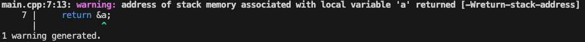

# 内存模型

> 计算机的内存模型：
>
> 计算机分配一段内存空间，存放某个值。
>
> 我们可以通过「内存空间的地址」和「值的类型」计算得到这个值的内存空间范围，从而读取到这个值。

只使用地址进行数值计算等操作显然非常麻烦。

举个例子，地址就是我们的**身份证号码**，，我们可以通过**身份证号码**称呼对方，身份证号码唯一标识一个个体。但是使用**身份证号码**显然非常麻烦，为了方便，日常生活我们会**使用人名代替身份证号码**。

基于这个思想，编程语言抽象了一个数据模型，名为variable（变量）。通过variable，我们可以通过name来代替地址进行复杂操作。

## 变量（variable）

variable（变量）由三个部份组成：

- name（变量名）
- type（变量类型）
- value（变量值）

### 变量的比较

变量的比较通过以下两部份判断：

- type（变量类型）
- value（变量值）

**只有类型相同才能比较，只有值相同才可以说两个变量相同**

### 声明（defination）和定义（declaration）

> 在C++中，defination意义在于将一个名称引入程序，表述「这个名字已经被占用」 或者 「告诉程序员或编译器未来会有这个东西，但是目前还没有实体化」。 defination没有涉及内存空间的分配和值的初始化，因此defination没有创建variable
> 
> 而在declaration中，直接创建了variable，这意味着进行了内存空间的分配和值的初始化。

在Go语言中，没有defination和declaration的区分，即使没有显式初始化，Go语言也会将其默认初始化为零值。也就是说，Go语言创建的都是variable。

Go创建variable方式为：

```go
var [variable_name] [type] = [expression]
```

Go提供了语法糖：

1. 编译器根据expression计算variable的type
  
```go
var a = 2 // a 为int类型
```

2. 没有expression时，编译器默认赋予type的零值

```go
var a int // a的值为0
```

### 定义的多种方法

```go
var a int = 2
var a int
var a = 2
```

适用场景：

- 全局变量
- 强调变量的类型

---

```go
a := 2
```

适用于局部变量（基本上局部变量都用这个）

---

```go
var p *int
p = new(int)
```

new(T)为类型T分配一块内存空间，初始化为零值，并返回内存空间的指针

适用场景：

- 强调使用的是指针，并且能够接受值初始化为零值

---

```go
type Person struct{
	Name string
	Age int
}

p := &Person{Name: "Alice", Age: 18}

```

适用场景：

- 使用指针，且自行初始化

---

```go
// 创建一个长度和容量都为5的int类型的slice
s := make([]int, 5)

// 创建一个map，键为string类型，值为int类型
m := make(map[string]int)

// 创建一个buffer大小为2的channel
c := make(chan int, 2)
```

适用场景：

- 仅适用于 slice、map 和 channel 这三种引用类型。
- 直接返回 slice、map 或 channel 类型的实例，而不是指针。

---

```go
var x, y int = 3, 4
var x, y = 2, "abc"

a, b := 3, 4
```

适用场景：多种变量同时定义

### variable的零值（zero value）

- int类型：0
- boolean类型：false
- string类型：""
- interface类型或其他引用类型 (slice, point er, map, channel, function)： nil
- 复合类型（array或struct）零值对应：每个元素赋予type对应的零值

## 指针

编程语言中的Pointer（指针）指代的是variable内存空间的地址

根据variable的定义，指针变量对应的三部份为：

- name：指针变量名
- type：指针类型（内存空间存放的值的类型）
- value：指针值（内存空间地址）

指针变量独有的API：解引用 "*"

解引用：通过指针变量的值（variable的地址）和指针声明的类型，获取对应的variable占用的内存空间，因此也可以视作获取了variable的使用权

这里的“获取”不仅仅是获得variable的value，而是获取整个内存空间的使用权。当然，在使用层面，效果等同于获取variable的name，因此我们也将其称为alias（别名）。

```go
package main

import "fmt"

func main() {
	a := 2
	var p *int
	p = &a
	fmt.Println(p) // 0x1400000e120
	fmt.Println(*p) // 2
}
```

>Not every value has an address, but every var iable does.

对于复合类型struct等，每个field都是variable，因此也能获取其指针

### 指针的值与比较

指针的零值为nil

指针的值可以进行比较，只有当两个指针都为nil或指向同一个内存空间时，指针的大小相同

指针的比较需要与指针变量的比较区分：

```go
package main

import "fmt"

func main() {
	var a int = 2
	var b int = 3
	var xptr, yptr *int
	xptr = &a
	yptr = &a
	// 指针的比较
	fmt.Println(&a == &a) // true
	fmt.Println(&a == &b) // false
	// 指针变量的比较
	fmt.Println(&a)
	fmt.Println(&xptr == &xptr) // true
	fmt.Println(&xptr == &yptr) // false
	fmt.Println(xptr == yptr)   // true
}
```

### 指针和变量名的使用场景

指针能够不使用变量名的情况下使用变量，适用于不需要变量名的情况。但是指针也算是变量的别名，会造成变量拥有多个别名，从而导致内存回收困难（需要收集所有的别名才知道变量的引用数有多少，不过这部分Go的GC垃圾回收帮我们解决了）

### 生命周期 & 野指针 & 内存逃逸

生命周期：指变量从定义到失效的时间段

野指针：指针指向的变量内存空间被回收

在C++中，有以下代码：

```C++
#include <iostream>

using namespace std;

int* retPtr() {
    int a = 2;
    return &a;
}

int main(){
    int* p = retPtr();
    cout << *p << endl;
}
```

函数内定义的局部变量（local variable）生命周期仅仅为「定义到函数返回」，即在栈上分配的内存，函数返回时该局部变量会被销毁，因此返回的指针指向的内存空间失效。这是典型的野指针。

报错如下：

  

而在Go中，同样的代码不会报错：

```go
package main

import "fmt"

func retPtr() *int {
	a := 2
	return &a
}

func main() {
	var p *int
	p = retPtr()
	fmt.Println(*p)
}
```

Go的内存管理非常特别，与C++不同，Go变量的生命周期不取决于语法，而是取决于它的使用周期。

「内存逃逸」：即任何语法都不能保证某个变量一定在栈或堆上分配内存，某个变量分配内存在栈还是在堆取决于这个变量的「使用周期」，即变量只要引用数不为0，则一直有效。Go的编译器为了保证有效，会将变量分配在对应的栈或堆上。

比如上述代码，由于p在main中使用了函数retPtr内声明的局部变量a，因此a分配在堆上。原本a的生命周期仅仅在函数retPtr中，应该分配给栈，现在发生了逃逸，逃逸到了堆上。

内存逃逸避免了野指针的情况，但是我们知道内存逃逸现象后，需要避免「理论上短生命周期的变量由于程序员变量的使用有误，导致该变量的实际生命周期变长，从而占用内存」

例如：

```go
package main

import (
	"fmt"
	"time"
)

func createLongLivedClosure() func() {
	var largeData = make([]byte, 1<<20) // 创建一个1MB大小的数据块
	for i := range largeData {
		largeData[i] = byte(i)
	}
	return func() {
		// 这里只是简单地打印第一个字节，实际上可能包含更复杂的逻辑
		fmt.Println(largeData[0])
	}
}

func main() {
	myClosure := createLongLivedClosure()
	
	// 假设这里有一些操作是间隔进行的
	time.Sleep(2 * time.Second)
	
	// 调用闭包函数
	myClosure()
	
	// 程序继续执行其他任务...
	time.Sleep(2 * time.Second)
}
```

在这个例子中，createLongLivedClosure 函数创建了一个大小为1MB的字节数组 largeData。虽然这个数组是在 createLongLivedClosure 函数内部定义的，并且按照常规的作用域规则，在函数返回后应该可以被垃圾回收，但由于它被返回的闭包函数所引用，因此它的实际生命周期延长到了闭包存在的整个期间。

即使 largeData 在 createLongLivedClosure 函数返回后不再直接可访问，但因为闭包持有了对它的引用，所以这块数据不能被释放，直到闭包本身不再被使用。如果这样的模式频繁出现或涉及更大的数据结构，则可能导致显著的内存占用问题。

这种情况下，解决方法之一是尽量避免在闭包中捕获大对象，或者确保这些对象尽早失去引用，从而让它们能够被垃圾回收器回收。如果必须使用这类大型数据结构，考虑将它们作为参数传递给需要使用的函数，而不是通过闭包捕获，这样可以更好地控制它们的生命周期。